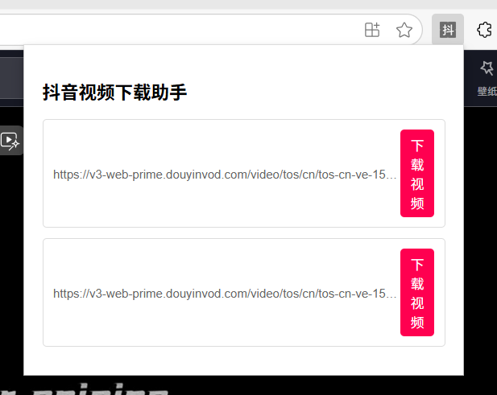

# 抖音短视频下载助手插件
这是一个一键下载抖音短视频的浏览器插件，旨在帮助快速下载抖音短视频到本地。尤其可以帮助到那些想要下载到本地，但视频作者关闭了保存本地功能的用户。

# 效果预览图

# 实现原理
通过监听网络请求，只拦截响应内容为视频文件的请求，拿到其请求地址，后续靠插件API下载到本地

# 下一个版本（2.0）待实现目标（todoList）
1. 一个更加完整美观的UI页面，更丰富的功能（如一键复制视频地址）
2. 插件页面显示视频名称，当前用的是视频访问地址所代替
3. 给出当前用户所浏览视频提示，例如高亮提示当前所浏览的视频对应的下载按钮位置

# 待攻克的难点
1. 由于抖音采取了预加载的方式，会提前请求后续的2-3个视频，并且请求的到达时间不确定，此插件实现的原理是请求到达后判断响应头的content-type属性判断是否为媒体文件，导致用户刷到的视频顺序是1->2->3,但是插件展示的下载顺序可能为1->3->2，导致下载错误视频问题
2. 要实现以抖音视频标题为视频下载名称，由于只能爬到当前网页展示的视频标题，后刷到视频的标题为动态生成，目前无法做到视频与标题对应。
3. 目前无法判断当前所浏览的视频对应的是哪一个下载按钮，无法高亮提示用户